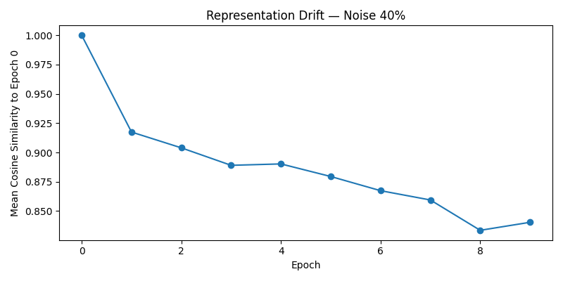
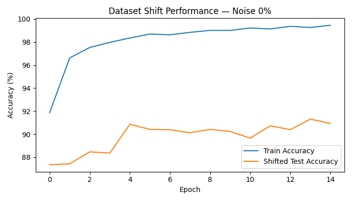
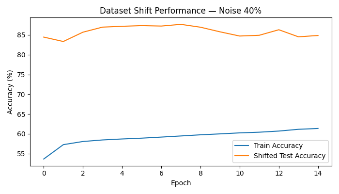

# Foundations of Deep Learning: Optimization, Generalization & Failure Modes

## Motivation
Deep neural networks train and generalize despite extreme overparameterization,
non-convex objectives, and noisy optimization. This project investigates why
training succeeds, when it fails, and how optimization and generalization
interact in modern deep learning systems.

## Key Empirical Findings

### Depth-Dependent Gradient Degradation

Despite successful optimization, deeper networks exhibit early gradient attenuation,
revealing trainability limits that are not reflected in accuracy alone.

## Where to Look First (2–3 minutes)
If you are short on time:
1. Open `figures/day9_representation_drift/` to see how representations destabilize under noise
2. Open `figures/day10_gradient_variance/` to see early-layer gradient instability
3. Open `figures/day12_dataset_shift/` to see robustness collapse under distribution shift
4. Read `reports/research_summary.md` for the full narrative

---

### Representation Drift under Memorization

With noisy supervision, internal representations drift rapidly even while training
accuracy improves, indicating memorization rather than structured learning.

---

### Gradient Variance and Learning Failure

Increased early-layer gradient variance temporally aligns with accelerated
representation drift, providing a mechanistic explanation for generalization failure.

### Dataset Shift Reveals Hidden Failure Modes

## Core Research Questions
- How do gradients behave as depth, width, and optimization choices vary?
- Why do some networks train successfully while others fail silently?
- What mechanisms govern generalization under noise and overfitting regimes?

## Scope
This project focuses on controlled empirical studies of:
- Optimization dynamics and trainability
- Gradient behavior in deep networks
- Generalization and memorization
- Failure modes beyond accuracy metrics

The emphasis is on mechanistic understanding rather than benchmark performance.

## Repository Structure

experiments/        # Training and analysis scripts
utils/              # Model, optimization, and logging utilities
reports/            # Detailed experiment notes and research summary
figures/            # Curated, final result figures

